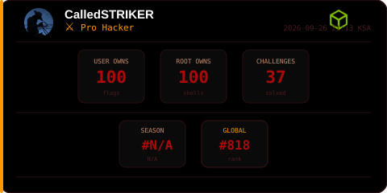

  

  

|                                                                                                                                                                                 |                                                                                                                                                                                 |                                                                                                                                                                                |                                                                                                                                                                                |
| :-----------------------------------------------------------------------------------------------------------------------------------------------------------------------------: | :-----------------------------------------------------------------------------------------------------------------------------------------------------------------------------: | :----------------------------------------------------------------------------------------------------------------------------------------------------------------------------: | :----------------------------------------------------------------------------------------------------------------------------------------------------------------------------: |
| 

 <strong><code>eCPPT</code></strong>
 | 

 <strong><code>eWPTX</code></strong>
 | 

 <strong><code>eWPT</code></strong>
 | 

 <strong><code>eJPT</code></strong>
 |
| 

<strong><code>Offshore</code></strong>

<strong><code>Pro Lab</code></strong>
          |       

<strong><code>Dante</code></strong>

<strong><code>Pro Lab</code></strong>
       | 

 <strong><code>OSCP+</code></strong>
         | 

<strong><code>Certified AppSec Pentesting eXpert (CAPenX)</code></strong>
         |
|                                                                                                                                                                                 |                                                                                                                                                                                 |                                                                                                                                                                                |                                                                                                                                                                                |

  
  
  
  
  
  

>
